# LINUX PALVELINTEN HALLINTA – TEHTÄVÄ H3 – TOPI MANNINEN
### Copyright Topi Manninen, GNU GENERAL PUBLIC LICENSE – GPL 3
#### Raportti on kirjoitettu kotitehtävien dokumentointia ajatellen ja välivaiheet voivat sisältää virheitä ja virheiden korjauksia. Teksti saattaa sisältää tarkoituksellisesti virheellisiä komentoja tai testausta. Älä seuraa tätä ohjeena ilman varmistamista mikä on tehtävän tarkoitus ja haluttu lopputulos.

Tehtävissä näkyvä kellonaika oikealla yläkulmassa on paikkaansapitävä Suomen sen hetkiseen kelloon.  Tehtävät ovat tehty Xubuntu 16.04.01 LTS 64-bit käyttöjärjestelmällä Virtualbox-ympäristössä.

## /srv/salt gittiin, sen kloonaaminen ja päivitys

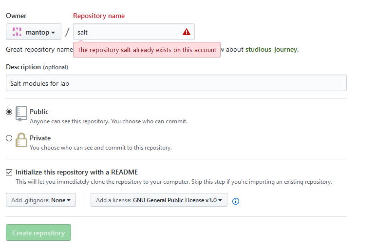

Olin jo kerennyt tekemään salt nimisen git-repositorion, mutta ylhäällä kuvassa näkyy millä asetuksilla tein tämän Githubiin.

Kun repositorio on Githubissa, seuraavaksi kloonaan se koneelle.
Koska minulla oli jo tässä virtuaalikoneessa aikaisemmin tehty /srv/salt, vaihdoin kansion nimen salt.old kansioksi.

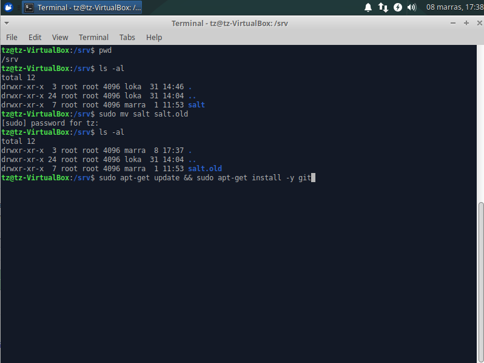

Asensin gitin komennolla
``sudo apt-get update && sudo apt-get install -y git``

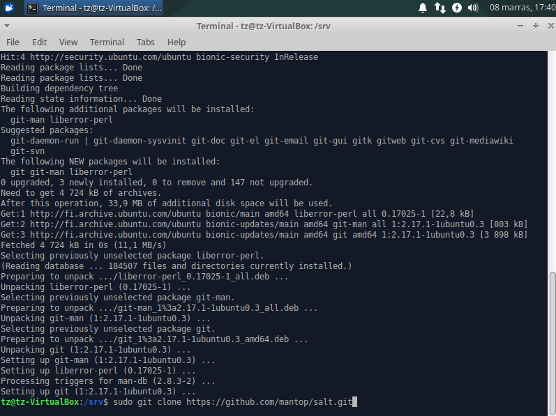

Githubin repositorio-sivulla löytyy linkki projektin lataamiseen tai kloonaamiseen vihreästä napista "Clone or download". 
Kloonaan Github-repositorioni Linuxiin komennolla:
``sudo git clone [repositorion osoite]``

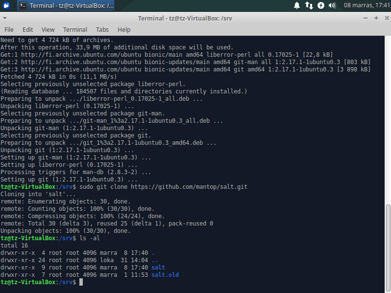

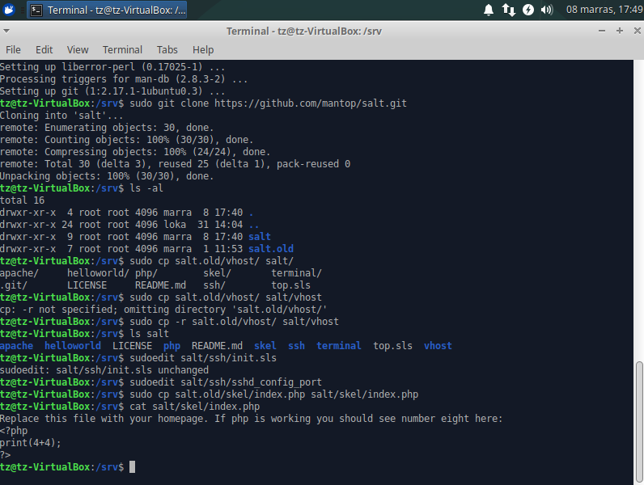

Lisään vanhasta salt-kansiostani moduulin nykyiseen salt-kansioon, korjaan ssh-konfiguraatiosta portin takaisin porttiin 22 etten vahingossa lukitse itseäni ulos virtuaalipalvelimeltani, jos en muista tehdä palomuuriasetuksia siirtäessäni konfiguraatiotani tietokoneeseen johon käytän SSH:ta yhdistämiseen. Siirsin myös vanhan index.php:n uuden tilalle. Vhost-moduuli on toimiva esimerkki, mutta jätin sen pois top.sls tiedostosta syystä etten tee muutoksia host-tiedostooni.

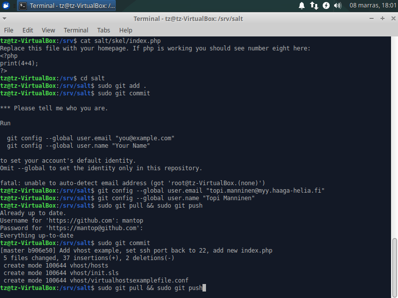

``sudo git add .``

``sudo git commit``

``sudo git pull && sudo git push``

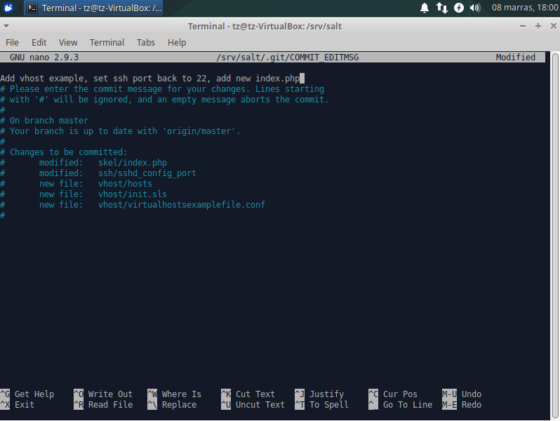

Kuvassa valitsemani commit message.

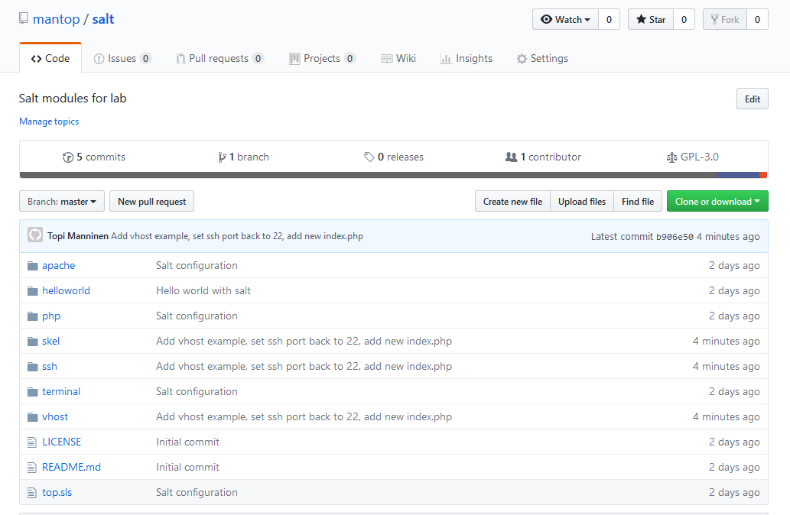

Ja näin muutokset näkyy Githubissa!

## Git log, git diff, git blame

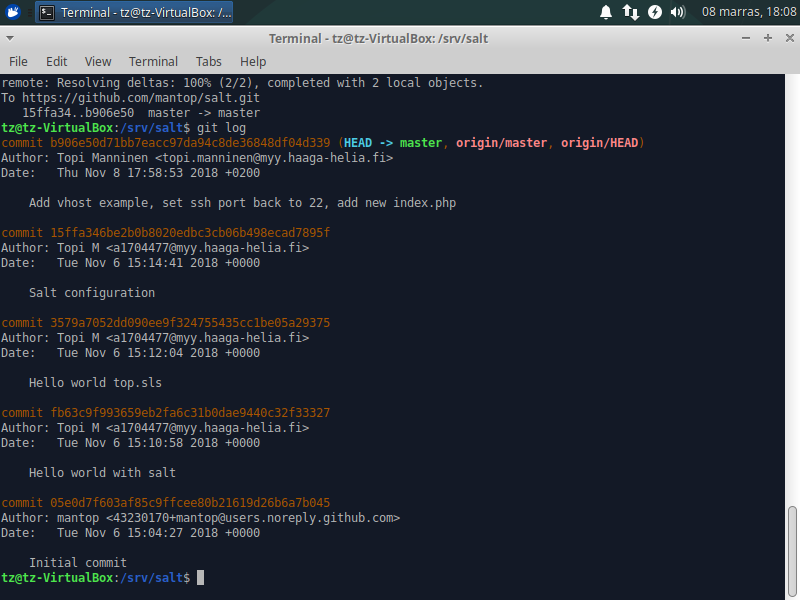

Kuvassa repositorioon tehdyt commitit.
Alin on Githubin luoma aloituscommit, joka loi automaattisesti GPL-3 lisenssin varastooni ja teki valmiiksi minulle README.md-tiedoston.
Kolme keskimmäistä on koulussa tekemiäni committeja, joiden commit messaget havainnollistavat hyvin tekemiäni muutoksia ja lisäyksiä. Viimeisin kotona tekemäni versio.

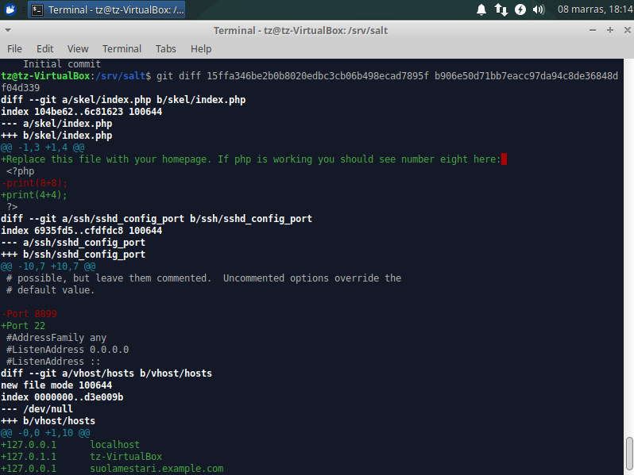

Git diff näytti kätevästi toisiksi uusimman ja uusimman version väliset erot, kuvassa näkee hyvin kuinka index.php sai muutaman rivin lisää ja kuinka ssh-konfiguraatiossa portti 8899 vaihdettiin alkuperäiseen 22-porttiin. Ihan alhaalla näkyy osa vhost-moduulista.

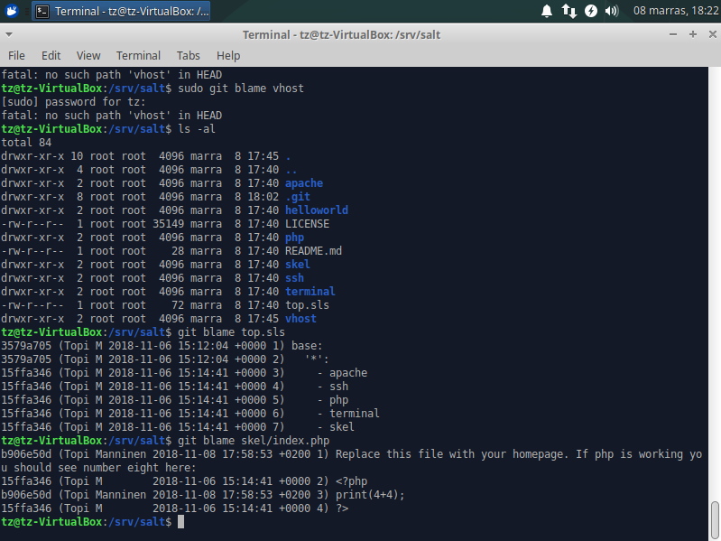

Git blame näyttää kätevästi rivit, muokkausajat ja tekijän tiedostosta, koska olen ainoa muokkaaja on nimeni ainoa joka näkyy, mutta onneksi käytin lyhennettyä versiota sukunimestäni koulussa, joten eron näkee helposti tässä tapauksessa.

## Git reset

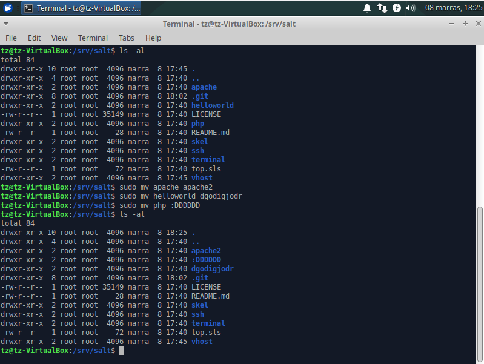

Kokeilin mitä kansioille tapahtuu jos muutan ne täysin eri nimisiksi, poistuuko ne ja vai jääkö ne elämään?

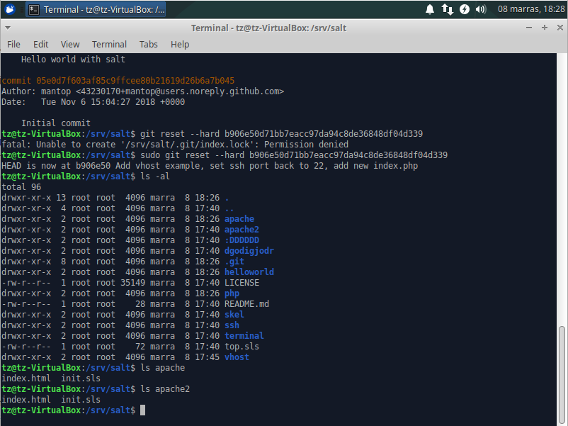

`` git reset --hard [commit] ``

Vastauksena kysymykselleni, uudelleennimettyjä kansioita ei poisteta, vain vanhat palautetaan, uusissa ja vanhoissa kansioissa on nyt identtinen sisältö.

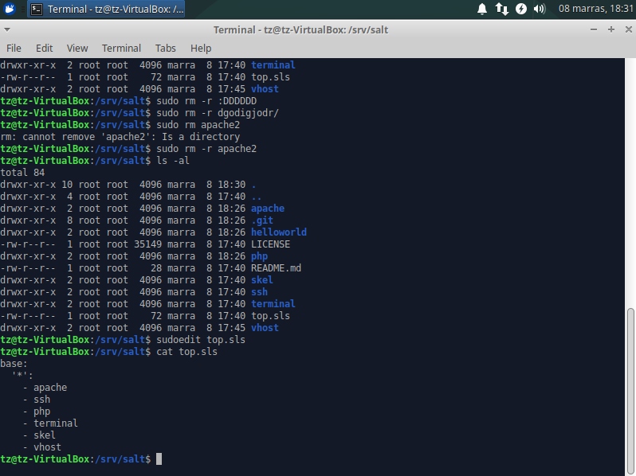

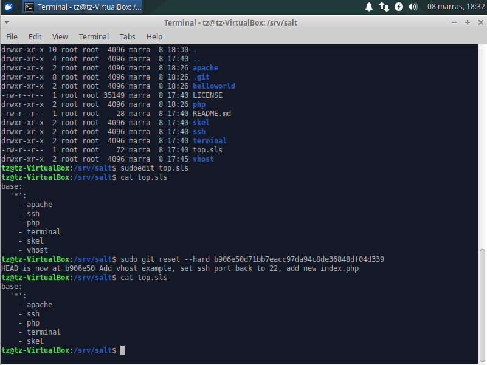

Tiedostoista sen sijaan ylimääräiset ymmärrettävästi lähtevät.

## Uusi Salt-moduuli

Haluan että salt-minion pysyy oikeassa konfiguraatiossaan, oikessa IP-osoitteessa, id:ssä ja että salt-minion paketti päivittyy automaattisesti.

**Huom! Tässä tehtävässä käytetty moduulin konfiguraatio-tiedosto olisi erittäin kehno useammalle kuin yhdelle orjakoneelle, syystä että orjan ID:n asetetaan yhdeksi ja samaksi.**

Useammalle orjakoneelle on suositeltavaa jättää id-kohta kokonaan pois ja jos sitä tarvitsee (esimerkiksi samannimisten tietokoneiden vuoksi) se kannattaa arpoa satunnaisesti jollain skriptillä.

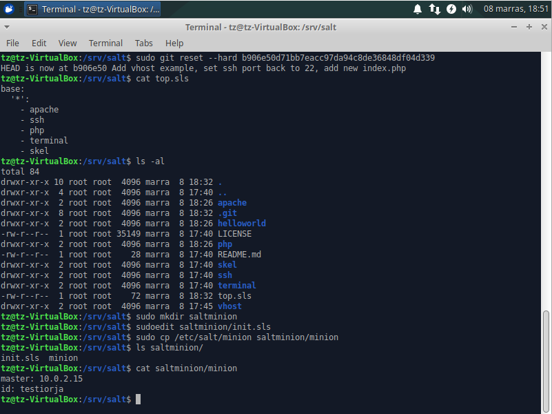

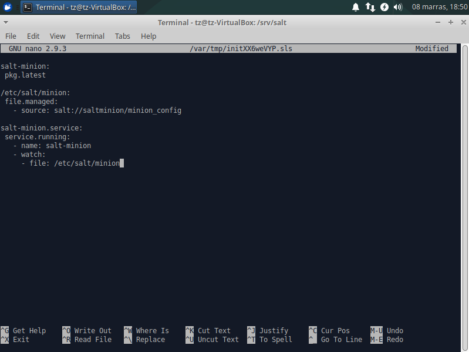

Saltminion init.sls sisältö

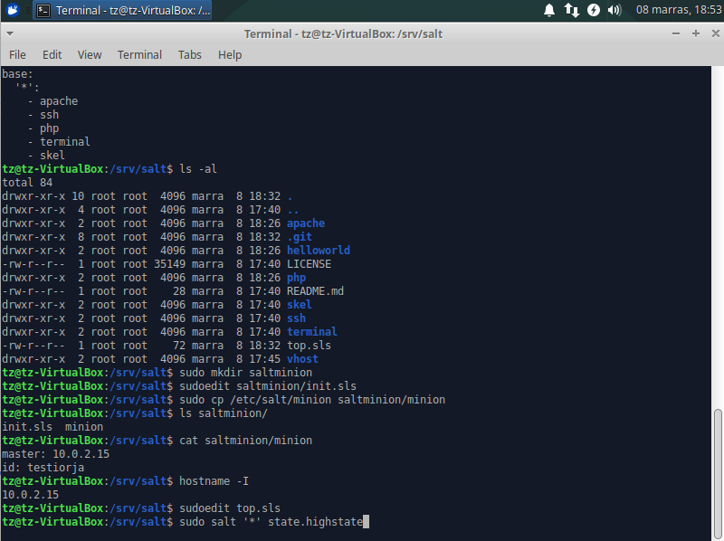

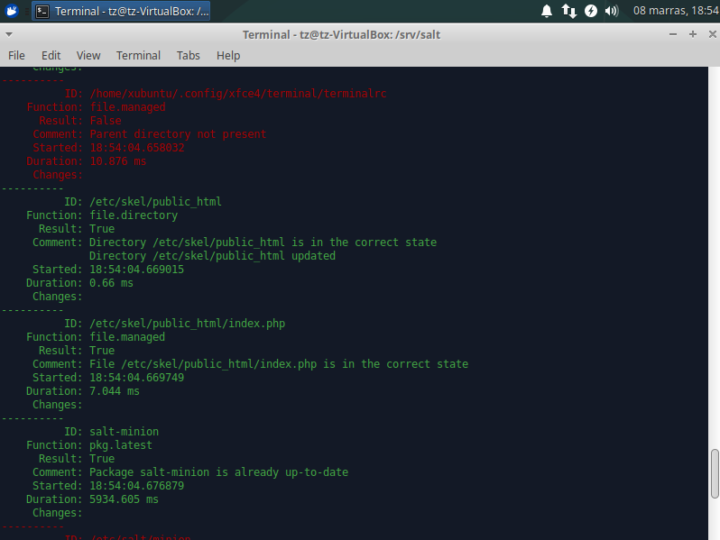

Kyseinen kohta muuttaa Xubuntu-käyttäjän (eli livetikulla ollessani) terminaali-ikkunan asetukset. Käyttäjänimeni on eri ja tästä syystä terminaali-asetukseni eivät vaihdu. Moduuli toimii odotetulla tavalla ja tämä ei johda toimenpiteisiin.

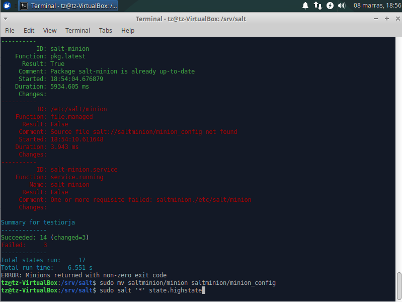

Salt-minion konfiguraatiotiedostoni oli eri niminen kuin konfiguraatiotiedostossani oli mainittu.

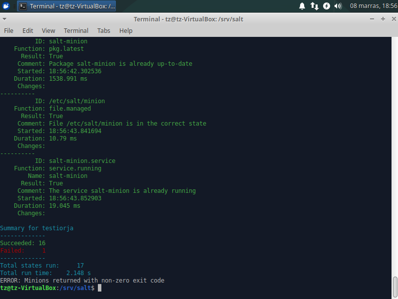

Edelleen tuo viimeinen virhe johtuu tuosta terminaali-asetuksesta, siitä ei välitetä.

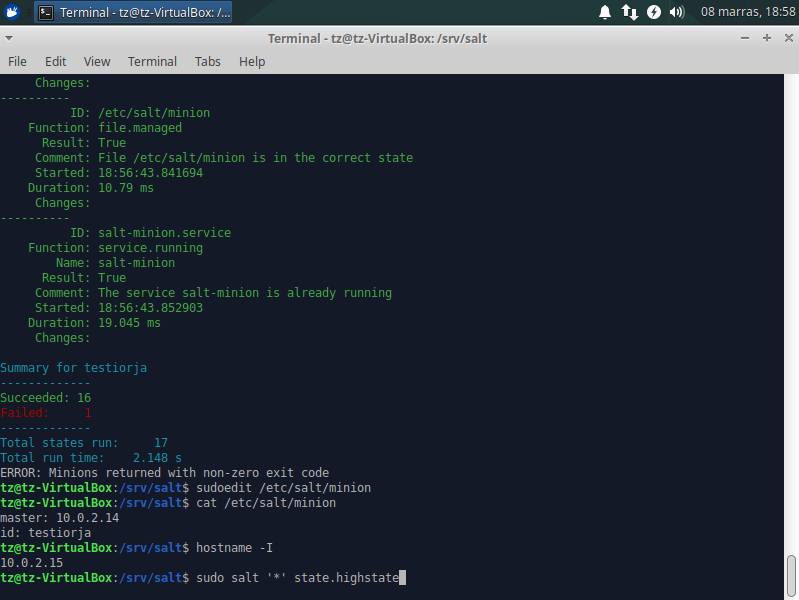

Kokeillaan käpälöidä minion-asetuksia ja katsotaan palauttaako salt asetukset oikeaksi.

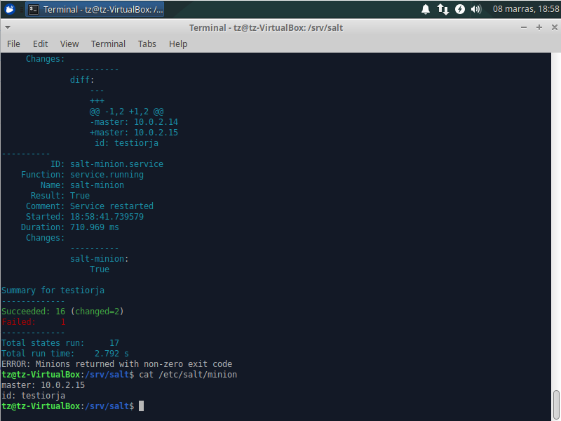

Kaikki on OK. Hurraa!

## Lähteet: 

Lähteet:

Tero Karvisen Palvelinten hallinta ict4tn022 3004- kurssin tiistaipäivän opetus.

Kotitehtävät:
http://terokarvinen.com/2018/aikataulu-%e2%80%93-palvelinten-hallinta-ict4tn022-3004-ti-ja-3002-to-%e2%80%93-loppukevat-2018-5p, Tero Karvinen, 22.10.2018.

Saltstack-dokumentaatio viimeisimmän version asennuksen hallintaan:
https://docs.saltstack.com/en/latest/ref/states/all/salt.states.pkg.html

Github:
https://Github.com
Omat Github sivuni: https://github.com/mantop/

Wordpress sivuni, joissa lisää linux-aiheisia kotitehtäviä ja niiden kotitehtävä raportteja:
https://topimanninen.wordpress.com/

Markdown!
Tämä raportti on kirjoitettu kotitehtävän mukaisesti Markdownilla. Kokeilin koulussa Markdownia linuxilla, joten halusin kokeilla Markdownia myös Windowssilla.
Käytän MarkDownin kirjoittamiseen Markdown Monster-nimistä ohjelmaa, joka on todella aloittelijaystävällinen, koska ohjelma värjää syntaksin ja näyttää oikealle esikatselun kirjoituksesta. 

Ohjelman mukana tuli myös SampleMarkdown.md -tiedosto, josta on kätevä katsoa mallia jos siltä tuntuu.

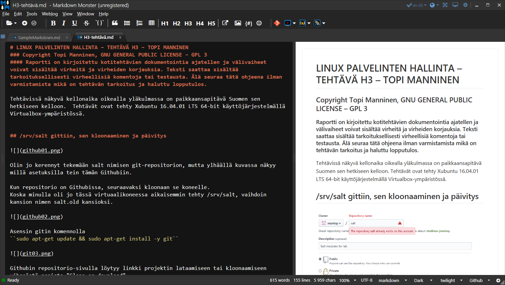

