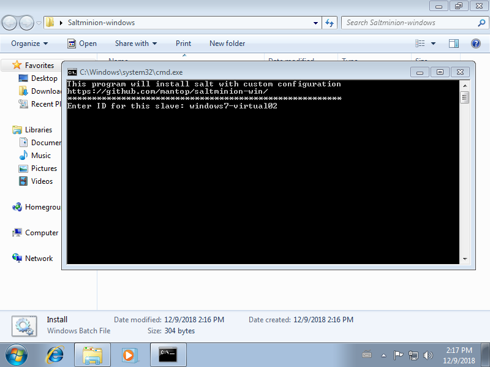
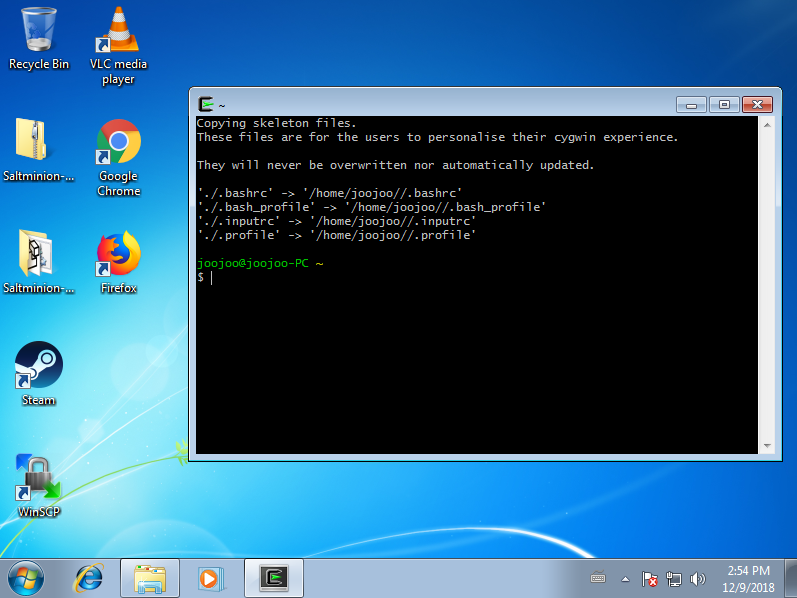
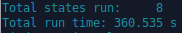
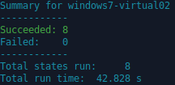
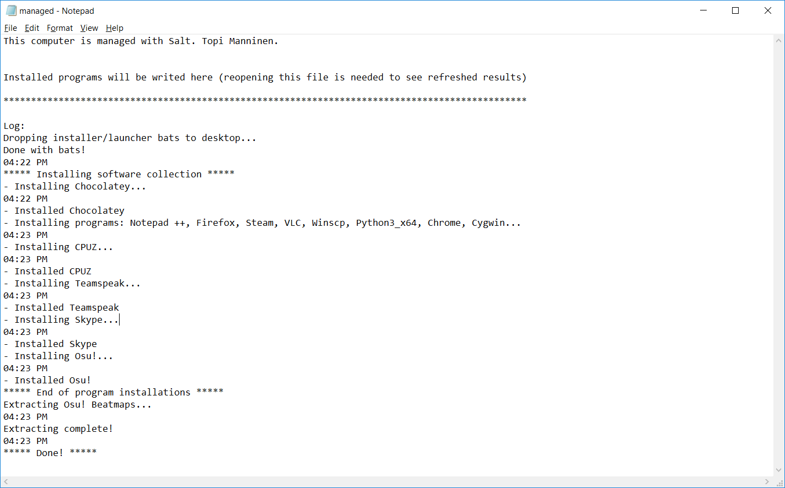
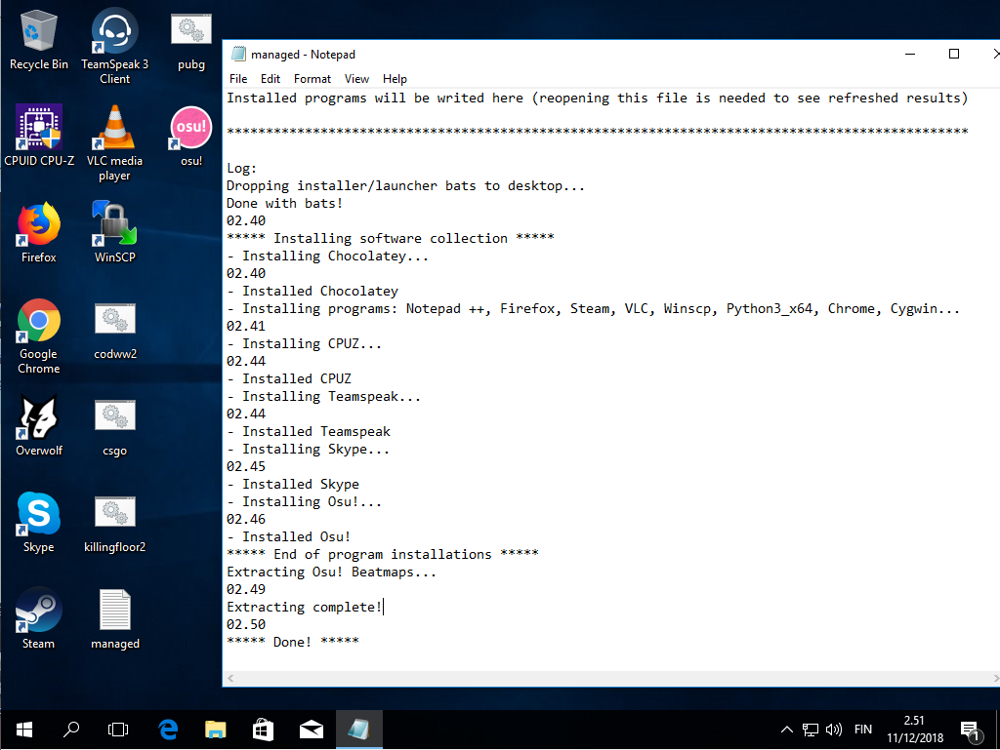

# Salt
## Salt personal configuration for Master (Ubuntu server), Linux and Windows.

My slave quick-installer for Linux (intended for ubuntu/xubuntu) [Saltminion](https://github.com/mantop/saltminion)

My slave quick-installer for Windows [Saltminion-win](https://github.com/mantop/saltminion-win)

### What does it do?
#### Linux
- Configure firewall with **ufw**
- Install **Apache2**-webserver and replaces default index site with placeholder file and enabled userdir-websites
- Install **SSH** with custom configurations and banner
- Install **PHP** with Mysql/Mariadb driver, enables PHP to be used in Apache userdir
- Edits font and coloring options on **xfce4-Terminal** (only works on live-xubuntu or if user is called "xubuntu")
- **Skel** public_html and placeholder index.php for new users created after this configuration and drops script *userresetscript.sh* to be run at anytime to create public_html and index.php placeholder file in user's homefolder.
- **Neofetch**

#### Master (Linux server)
- Configure **ufw** firewall with salt-friendly settings
- Install **Apache2**-webserver and replaces default index site with placeholder file and enabled userdir-websites
- Install **SSH** with custom configurations and banner
- Install **PHP** with Mysql/Mariadb driver, enables PHP to be used in Apache userdir
- Edits font and coloring options on **xfce4-Terminal** (only works on live-xubuntu or if user is called "xubuntu")
- **Skel** public_html and placeholder index.php for new users created after this configuration and drops script *userresetscript.sh* to be run at anytime to create public_html and index.php placeholder file in user's homefolder.

#### Windows (10)
- Drops .bat files to my Desktop with gamename on them for fast install/launch of said game from Steam
- Install/keeps updated **huge load of programs** and my personal configurations if any
- Extracts my favorite Osu!-beatmaps to be ready to be played 
(sorry, not included in Github, name yours *Songs.zip* and place it to windows-software)
- Writes a **log** to desktop of progress with timestamps
- Schedules **O&O ShutUp10** be run with custom configuration every 10 hours to counter Windows update / other reasons reverting privacy settings

#### Windows (7)
- "Lazy installer" not tied to any usernames, does not write any logs, just installs programs and drops .bat-files
- Because of no hard coded username, drops files to C:\

-----------------

### Pictures

Windows 7 with the [Saltminion-win](https://github.com/mantop/saltminion-win)

From Master:
Installation time from clean win7-virtual

Second time running state.highstate

How log-file looks in managed Windows-10 computer:

Easier to spot from managed computer if something gets stuck / program has been updated recently from timestamps

Windows10 state run in fresh virtualpc
